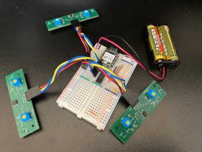
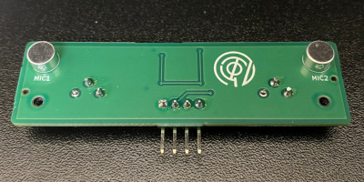

# zatopos
マイクアレイと音の鳴るスリッパを使って音源の位置推定したい

名前の由来は座頭市(zatoichi)と位置(position)のもじり

## ハードウェア
回路図等は下記リンク（Googleドライブ）に
https://drive.google.com/drive/folders/14RrMDmcTrZvTik9sNmVn-uP1jltOWX2_?usp=drive_link

### マイクアレイ試作1号
 
 
* マイク+アンプ基板 x 3
  * 緑の基板
  * 基板1枚につきマイク&アンプ回路が2個ずつ
  * 自作
  * 電源は電池
* A/Dコンバータ
  * MCP3008
  * 6個のマイクから来た電圧を順次変換
  * 電源はUSB経由
* マイコン
  * Seeed XIAO RP2040
  * 電源はUSB経由

## ソフトウェア
* zatopos-worker
  * マイクアレイのファームウェア
  * C言語
  * https://github.com/kazetatsu/zatopos-worker

* zatopos-leader
  * マイクアレイが拾った音を処理
  * Pythonパッケージ
  * https://github.com/kazetatsu/zatopos-leader

## 動作テスト
波形表示
https://www.youtube.com/watch?v=E2x_qtEzeyc
